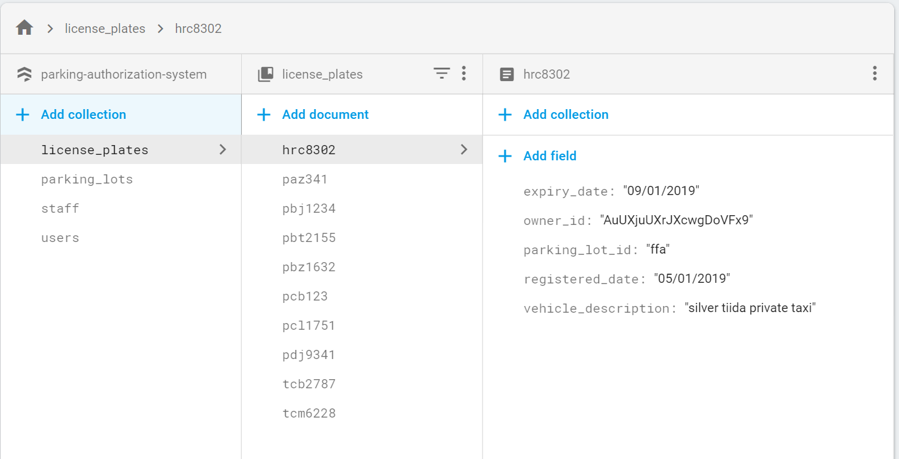

A semi-automatied Parking Authorization System for private parking lots

---
This `readme` is a very brief overview of the University of the West Indies Undergraduate Final Year Project by Jason Mongroo, Christopher Joseph and Christopher Sahadeo  

For full documentation of the project, see the [Final Project Document](https://docs.google.com/document/d/1D05I-PZ11wCX9HCOwYlwmzHtLbTIKDZsj3kiXzwSIww/edit?usp=sharing)

---
<a href="https://www.youtube.com/watch?v=vRkwVC5I1A8
" target="_blank"></a>

---
# What is PAS?
The difficulty and impracticality in assessing the authorization of a vehicle to occupy a spot in a private parking lot affects business owners as well as the authorized vehicle owners. Current rudimentary private parking lot systems often consist of a motorized barrier with multiple remotes that are distributed to valid drivers. Problems with the current paradigm include the need for expensive equipment (multiple barrier remotes, phone calls or RFID cards to control the barrier), significant (24/7) staff supervision, the haphazard granting of (unauthorized) visitor permissions, the need for visible parking passes and the lack of parking lot occupancy count.

A successful solution would be the implementation of a semi-automated, computer-oriented Parking Authorization System (PAS). A physical, motorized barrier would be positioned at the parking space’s entrance and/or exit. A mounted camera will perform Optical Character Recognition (OCR) on a given vehicle’s license plate as it approaches the barrier. If the license plate number exists in an online database of authorized numbers, then the vehicle is granted entrance and parking lot occupancy is incremented. Else, the vehicle is denied entrance. Parking lots, admins and valid drivers can all be remotely managed via a cloud hosted website.

# How does it work?
PAS is made up of 3 major components:

## [The Website](https://parking-authorization-system.firebaseapp.com/)
Switch to the `website` branch for website code.

***Login Info***
```
To Login as Admin:

Email: jasonnonstop16@gmail.com
Password: JAMO4664


To Login as Security Officer:

Email: jason_m_star@hotmail.com
Password: 16jaseyboy98 
```

Web technologies used:
- HTML
- CSS
- JS
- Nice Admin Bootstrap Template
- Hosted using Firebase

The website is used to create, read, update and delete
- Parking Lots
- Valid License Plates
- Staff (Admins and Security)

All data is stored in Cloud Firestore

[Click here](https://docs.google.com/document/d/1D6CbtGffPTY7PrimcSm5r5Hb09zgTyVl5zpLzogIxSk/edit?usp=sharing) for more information on the website.


## [Database (Cloud Firestore)](https://console.firebase.google.com/u/4/project/parking-authorization-system/database/firestore/data~2Flicense_plates~2Fhrc8302)


PAS uses Firebase Cloud Firestore to store system data. This is a NoSQL design and as such an ERD is not possible. The NoSQL denormalized design makes queries and updates extremely quickand simple. Below are some screenshots that reflect the firebase collection and document hierarchy:

The database consists of 4 major collections:
- license_plates
- parking_lots
- staff
- users


## [Barrier Control System](https://docs.google.com/document/d/1D6CbtGffPTY7PrimcSm5r5Hb09zgTyVl5zpLzogIxSk/edit?usp=sharing)
Switch to the `pi` branch for the raspberry pi code.  
At the heart of the barrier control system is the Raspberry Pi 3 Model B+  


The distance sensor detects when a vehicle is in front of the barrier. This triggers the camera which takes a picture of the vehicle’s license plate. The Pi makes a POST request to the OpenALPR cloud service. OpenALPR returns a string consisting of the vehicle’s license plate. The string is checked against the Cloud Firestore database. If the plate is in the database, and has not expired and there is space in the parking lot, then the vehicles is valid. The Pi sends a signal to the relay which pulses the barrier remote and the barrier raises. The vehicle enters the parking lot and the occupancy count is incremented. A similar process ensues for vehicles exiting the parking lot.

**Raspberry Pi Quick Start**  
- Clone this repo onto Raspberry Pi with [Raspbian Stretch desktop (Full)](https://www.raspberrypi.org/downloads/raspbian/)
- Checkout the `pi` branch
- Enable [SSH, VNC, GPIO and Camera Module](https://pythonprogramming.net/camera-module-raspberry-pi-tutorials/) using `raspi-config`.
- Install firebase

```
sudo pip install firebase-admin
```
- Making [OpenALPR POST Requests](http://doc.openalpr.com/bindings.html)
- Run `PAS.py`

